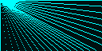
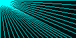
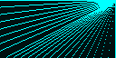
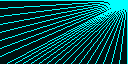
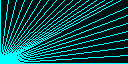
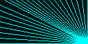
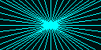

# OledComparison

This repo show the difference in line drawing between the original `oled` package and the enhanced branch from https://github.com/udoschneider/oled/tree/fix-13-14_linedrawing.

To generate the comparison image you need to (un-)comment the branch in `mix.exs`:

```elixir
      # (un-)comment the following line to load the fixed or original code
      # {:oled, git: "https://github.com/udoschneider/oled.git", branch: "fix-13-14_linedrawing", override: true},

      {:oled_virtual, "~> 1.0"},
    ]
```

Don't forget to call `mix deps.clean -all` and `mix deps.get` after switching.

The images can then be created using

```elixir
iex> OledComparison.Display.test_pattern("orig")
```

The parameter is the prefix for the files. The files created have a suffix of `tl`, `tr`, `bl`, `br` and `ct` denoting the origin of line drawing (topLeft, topRight, bottomLeft, bottomRight and center).

### Visual comparison table

| Origin | Original Linedrawing | Enhanced Linedrawing |
| --- | --- | --- |
| Topleft |  |  |
| Topright |  |  |
| Bottomleft |  |  |
| Bottomright |  |  |
| Center |  |  |

Please note the visual discrepancies/quality in nearly vertical lines.
Please also note that verticals lines are completely missing if the line points upwards.


## Installation

If [available in Hex](https://hex.pm/docs/publish), the package can be installed
by adding `oled_comparison` to your list of dependencies in `mix.exs`:

```elixir
def deps do
  [
    {:oled_comparison, "~> 0.1.0"}
  ]
end
```

Documentation can be generated with [ExDoc](https://github.com/elixir-lang/ex_doc)
and published on [HexDocs](https://hexdocs.pm). Once published, the docs can
be found at <https://hexdocs.pm/oled_comparison>.

